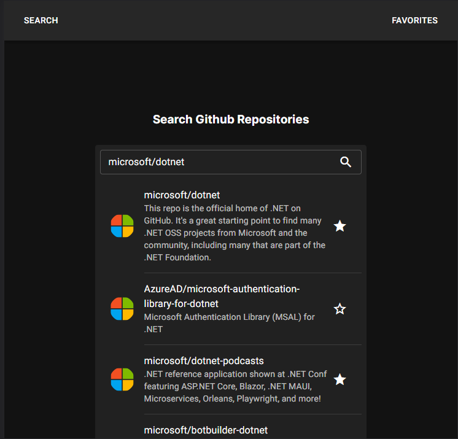
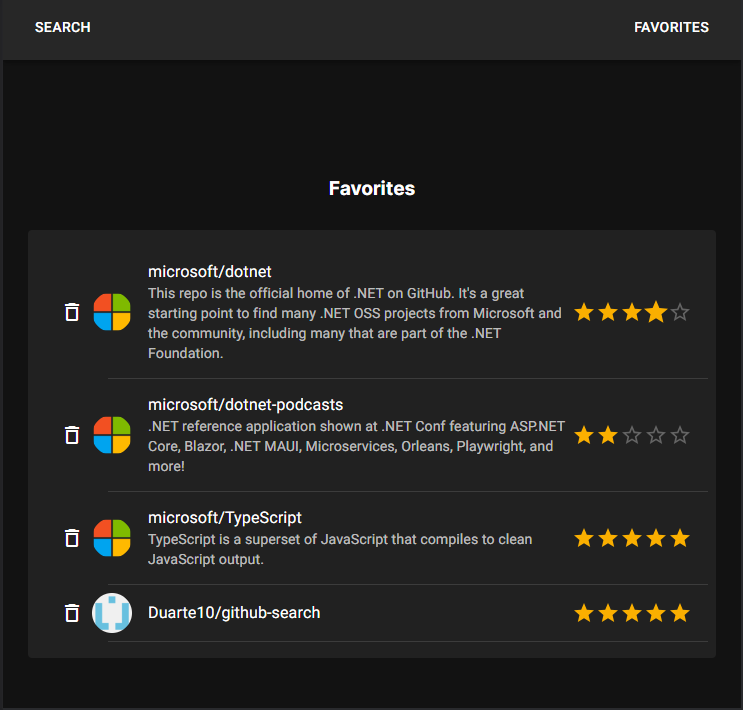

<!-- omit from toc --> 
# GitHub Search Interface using GraphQL, React and TypeScript

Search, star and rate GitHub repositories using GitHub GraphQL API.




<!-- omit from toc --> 
## Table of Contents
- [Technologies Used](#technologies-used)
- [Getting Started](#getting-started)
- [Features](#features)
- [Usage](#usage)
- [Project Structure](#project-structure)
- [Development choices](#development-choices)

## Technologies Used

- [React.js 18](https://reactjs.org/) : A popular JavaScript library for building user interfaces.
- [Next.js 13](https://nextjs.org/) : A React framework that offers server-side rendering, routing, and other powerful features.
- [MUI 5](https://mui.com/) (formerly Material-UI) : A UI component library that enhances the project's visual appeal.
- TypeScript: A typed superset of JavaScript that enhances code quality and development experience.
- GraphQL : Used to query GitHub for repository information.
- ESLint, and Prettier are used to improve the developer experience

## Getting Started

First, install the dependencies:

```bash
npm install
# or
yarn install
```

Replace github token:

On `src/app/page.tsx`, replace `%GITHUB_PAT%` with you github token.

[How to get a github fine grained token](https://docs.github.com/en/authentication/keeping-your-account-and-data-secure/managing-your-personal-access-tokens)

Then, run the development server:

```bash
npm run dev
# or
yarn run dev
```

This project uses [`next/font`](https://nextjs.org/docs/basic-features/font-optimization) to automatically optimize and load Inter, a custom Google Font.


## Features

1. **Repository Search**: Users can search for repositories on GitHub by typing in the search field. Search results are displayed as the user types, with debounce functionality to avoid excessive API calls.

2. **Favorite Repositories**: Each search result item can be marked as a favorite using the "Star" icon. If an item is already marked as a favorite, it will be rendered as a favorite again.

3. **Favorites List**: Users can navigate to a list of their favorite repositories. This list is maintained in memory with a Redux storage while the user is on the app.

4. **Rating Evaluation**: Users can rate their favorite repositories using a MUI rating component that ranges from 1 to 5.

5. **Removal of Favorites**: Items can be easily removed from the favorites list (Star icon).

6. **Material UI Integration**: The user interface is enhanced with Material UI components such as the list and rating components, providing a visually appealing and user-friendly design.

## Usage

1. **Search for Repositories**: Enter your search query in the search field. When you are done typing, the search results will appear below the search bar.

2. **Favorite a Repository**: In the search results, each repository item will have a "Favorite" icon. Click this button to mark a repository as a favorite. If already marked as a favorite, the star will appear full.

3. **View Favorites**: Navigate to the favorites list by clicking the "Favorites" button. Here, you can view your list of favorite repositories.

4. **Rate Repositories**: In the favorites list, each repository item will have a rating evaluation feature. Rate your favorite repositories on a scale from 1 to 5.

5. **Remove from Favorites**: To remove a repository from your favorites list, click the "Remove" button associated with that repository.

## Project Structure

The project is structured as follows:

- `app/`: Houses Next.js pages that correspond to different routes.
- `storage/`: Holds Redux-related files including actions, reducers, and store configuration.
- `interfaces/`: Includes IRepository definition.

## Development choices

- GraphQL : when a user enters an input, we will fetch  the first 15 repositories that match the string entered by the user using the [Github Graphql API](https://docs.github.com/en/graphql). The `IRepository` interface maps the results with distinctive fields (`id`,
  `name`, `shortDescriptionHTML` and `ownerAvatarUrl`) which simplifies rendering of the list items. The load more button will get the 15 next repositories that matches the user input. 
- Debounce : the mechanism to limit the number of API calls was implemented using a timeout that is set every time the user modifies the search string. If the timeout runs out then the search method will trigger the API call, otherwise if the user is not done typing then the timeout will be reset.
- Memory storage : using Redux to store the favorite repositories in this app ensures a centralized, predictable state management that facilitates the interaction between components.